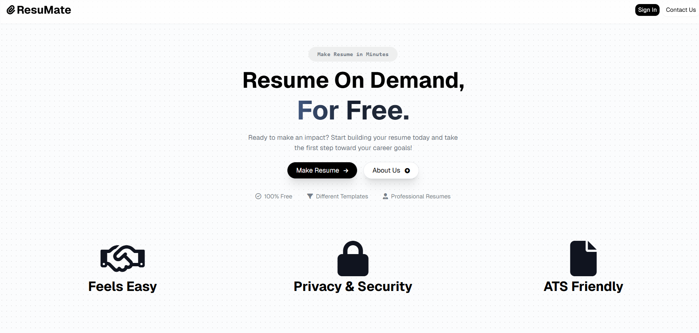
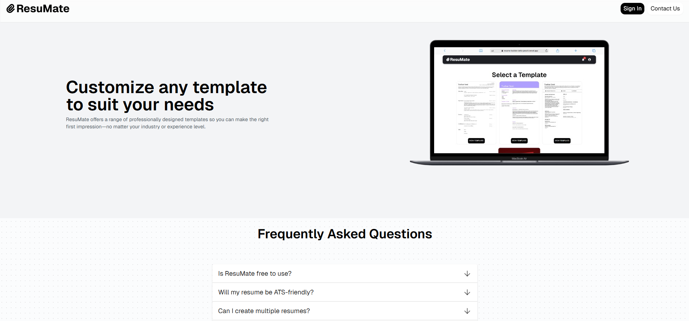
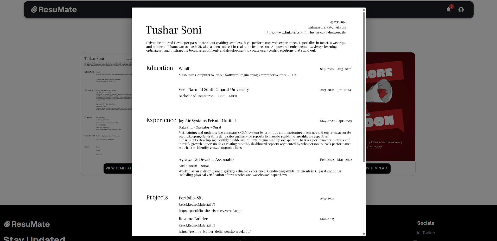
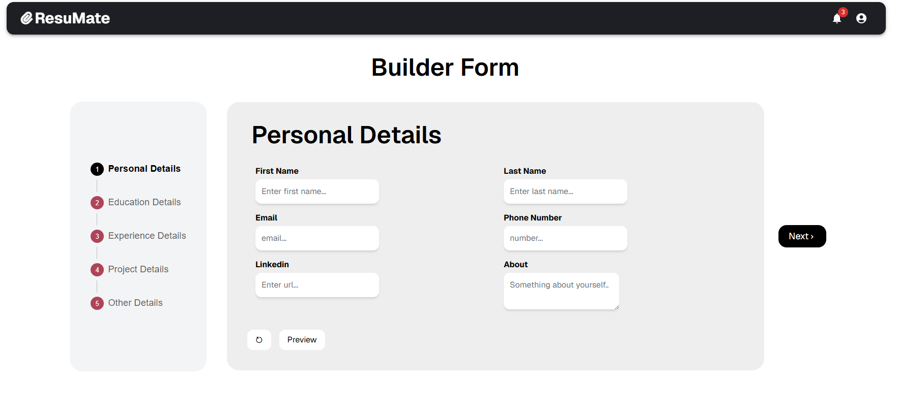

# ResuMate

Resumate is a powerful and user-friendly resume builder designed to help users create professional resumes with ease. Built with React and Redux, Resumate provides customizable templates, live previews, and export options to generate high-quality resumes.

## Features

- Customizable Templates - Choose from multiple resume templates to match your style.
- Live Preview - See real-time changes as you edit your resume.
- PDF Export - Generate and download your resume as a PDF using jsPDF.
- User Authentication - Secure login and resume management using Firebase Authentication.
- Data Persistence - Save and retrieve user data with Appwrite storage and database.

## Tech Stack

- **Framework & Library :** React, Redux, TailwindCSS, Material UI
- **Authentication :** Firebase
- **Backend as a Service :** Appwrite
- **Icons:** FontAwsome, RemixIcons
- **Email Service:** EmailJS
- **PDF Generation:** jsPdf
- **E2E Testing:** Cypress

## Demo Screenshots

## 🔗 Links

